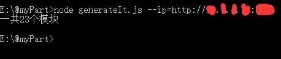
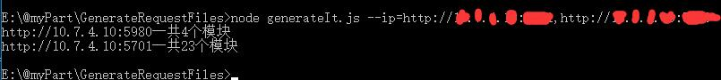

<!--
 * @Author: littleHiuman
 * @Date: 2020-11-28 15:52:21
 * @LastEditTime: 2020-11-28 16:53:32
 * @LastEditors: littleHiuman
 * @Description: README文件
-->
# GenerateRequestFiles
根据后端提供的swagger生成配置文件（JavaScript文件）【简单的说，就是生成api目录】

## 用法
假设后端提供的swagger地址是http:255.255.255.255:3000/swagger-ui.html ，只需要取前面部分就可以了（ip加端口）

一个ip的情况下：
`node generateIt.js --ip=http:255.255.255.255:3000`

多个ip的情况下（使用,来分割）：
`node generateIt.js --ip=http:255.255.255.255:3000,http:255.255.255.254:1000`

---

## 说几句
（重要的事情说三遍）

**生成之前会先删掉文件夹里面的内容**，受影响的话，请把内容移动到其他文件夹！！！

**生成之前会先删掉文件夹里面的内容**，受影响的话，请把内容移动到其他文件夹！！！

**生成之前会先删掉文件夹里面的内容**，受影响的话，请把内容移动到其他文件夹！！！

---
生成之后会有一句提示：一共n个模块

这个模块是按请求url来划分的，比如：

/adminUser/test、/adminUser/jest
这两个就属于一个模块（adminUser模块）

/adminUser/test、/test/adminUser
这两个就属于两个模块（adminUser模块，test模块）

---
生成的文件夹是有顺序的（和ip顺序一样），文件夹名称暂定是api加索引（api0、api1、…apin）

是在执行该工具的目录下生成的

---
因为是根据swagger来生成的配置文件，后端对接口描述越详细越好

我们这里的后端提供的swagger对接口描述的不是特别详细（比如图中有的字段没有描述），所以这个工具的提升空间很大（哈哈哈）

下面的图中的请求参数的类型使用的是后端定的类型，我没有去处理…（我加到下面的问题里了）

还有就是！如图，`import request from '@/utils/request'`这一句我暂时是写死的（我加到下面的问题里了）

---
已发现的问题：

1. 如果后端对参数类型描述不准确，得人力去改…（哭
2. 请求参数的类型使用的是后端定的类型
3. request文件的引入和命名，暂时是写死的（`import request from '@/utils/request'`）
4. **导出文件这种类型的接口（返回值是文件），需要自己添加`responseType: 'blob'`**
5. 

---
对您有帮助的话，麻烦帮我点个star呀！

欢迎大家来完善这个工具或者提问题反馈一下呀！

这个工具仅作学习和辅助使用哦。
